# UML Use Case Diagram - Tourist Accommodation Management System (TurismApp)

## PlantUML Code

```plantuml
@startuml TurismApp_UseCaseDiagram

!define LIGHTBLUE #E8F4FD
!define LIGHTGREEN #E8F5E8
!define LIGHTYELLOW #FFF8DC
!define LIGHTPINK #FFE4E1

title Tourist Accommodation Management System - Use Case Diagram

' Define actors
actor "Client" as Client
actor "Property Owner" as Owner
actor "Administrator" as Admin

' Define system boundary
rectangle "TurismApp System" {
    
    ' Client use cases
    package "Client Operations" LIGHTBLUE {
        usecase "Search Accommodations" as UC1
        usecase "Filter by Location" as UC2
        usecase "Filter by Price Range" as UC3
        usecase "Filter by Accommodation Type" as UC4
        usecase "Filter by Guest Capacity" as UC5
        usecase "Filter by Rating" as UC6
        usecase "Filter by County" as UC7
        usecase "View Accommodation Details" as UC8
        usecase "Make Booking" as UC9
        usecase "Cancel Booking" as UC10
        usecase "View Booking History" as UC11
        usecase "Rate Accommodation" as UC12
        usecase "Write Review" as UC13
        usecase "Register Account" as UC14
        usecase "Login/Logout" as UC15
        usecase "Manage Profile" as UC16
        usecase "Receive Email Notifications" as UC17
    }
    
    ' Property Owner use cases
    package "Property Owner Operations" LIGHTGREEN {
        usecase "Add Accommodation Unit" as UC18
        usecase "Edit Accommodation Unit" as UC19
        usecase "Delete Accommodation Unit" as UC20
        usecase "Upload Property Images" as UC21
        usecase "Set Pricing" as UC22
        usecase "Set Availability" as UC23
        usecase "View Incoming Bookings" as UC24
        usecase "Accept Booking" as UC25
        usecase "Reject Booking" as UC26
        usecase "View Profit Dashboard" as UC27
        usecase "Generate Profit Reports" as UC28
        usecase "Manage Property Amenities" as UC29
        usecase "View Property Reviews" as UC30
        usecase "Respond to Reviews" as UC31
        usecase "Apply for Owner Status" as UC32
    }
    
    ' Administrator use cases
    package "Administrator Operations" LIGHTYELLOW {
        usecase "Manage User Accounts" as UC33
        usecase "Monitor All Reservations" as UC34
        usecase "Generate System Reports" as UC35
        usecase "Approve Owner Applications" as UC36
        usecase "Reject Owner Applications" as UC37
        usecase "Moderate Reviews" as UC38
        usecase "System Backup & Maintenance" as UC39
        usecase "View System Analytics" as UC40
        usecase "Manage System Settings" as UC41
        usecase "Handle Disputes" as UC42
    }
    
    ' Shared/System use cases
    package "System Operations" LIGHTPINK {
        usecase "Send Email Notifications" as UC43
        usecase "Process Payments" as UC44
        usecase "Generate Confirmation" as UC45
        usecase "Validate Data" as UC46
        usecase "Log Activities" as UC47
    }
}

' Client relationships
Client --> UC1
Client --> UC2
Client --> UC3
Client --> UC4
Client --> UC5
Client --> UC6
Client --> UC7
Client --> UC8
Client --> UC9
Client --> UC10
Client --> UC11
Client --> UC12
Client --> UC13
Client --> UC14
Client --> UC15
Client --> UC16
Client --> UC17

' Property Owner relationships
Owner --> UC18
Owner --> UC19
Owner --> UC20
Owner --> UC21
Owner --> UC22
Owner --> UC23
Owner --> UC24
Owner --> UC25
Owner --> UC26
Owner --> UC27
Owner --> UC28
Owner --> UC29
Owner --> UC30
Owner --> UC31
Owner --> UC32
Owner --> UC15 : also uses
Owner --> UC16 : also uses

' Administrator relationships
Admin --> UC33
Admin --> UC34
Admin --> UC35
Admin --> UC36
Admin --> UC37
Admin --> UC38
Admin --> UC39
Admin --> UC40
Admin --> UC41
Admin --> UC42
Admin --> UC15 : also uses

' Include relationships (dependencies)
UC1 ..> UC2 : <<include>>
UC1 ..> UC3 : <<include>>
UC1 ..> UC4 : <<include>>
UC1 ..> UC5 : <<include>>
UC1 ..> UC6 : <<include>>
UC1 ..> UC7 : <<include>>

UC9 ..> UC44 : <<include>>
UC9 ..> UC43 : <<include>>
UC9 ..> UC45 : <<include>>

UC25 ..> UC43 : <<include>>
UC26 ..> UC43 : <<include>>

UC18 ..> UC46 : <<include>>
UC19 ..> UC46 : <<include>>

' Extend relationships (optional flows)
UC8 ..> UC9 : <<extend>>
UC11 ..> UC10 : <<extend>>
UC30 ..> UC31 : <<extend>>

@enduml
```



## ASCII Art Version (Simplified)

```
                    Tourist Accommodation Management System
    
    +----------+                                                        +----------+
    |  Client  |                                                        |   Admin  |
    +----------+                                                        +----------+
         |                                                                   |
         |                    +------------------------+                     |
         |                    |                        |                     |
         +-----> Search Accommodations                 |                     |
         +-----> Filter (Location, Price, Type, etc.)  |                     |
         +-----> View Details                          |                     |
         +-----> Make Booking                          |                     |
         +-----> Cancel Booking                        |                     |
         +-----> View Booking History                  |                     |
         +-----> Rate & Review                         |                     |
         +-----> Manage Profile                        |       System        |
         |                    |                        |                     |
         |                    |                        |                     |
         |                    +------------------------+                     |
         |                                                                   |
         |                                                                   |
         |    +---------------+                                              |
         |    | Property Owner |                                             |
         |    +---------------+                                              |
         |           |                                                       |
         +-----> Add/Edit/Delete Units                                       |
         +-----> Upload Images                                               |
         +-----> Set Pricing & Availability                                  |
         +-----> View/Accept/Reject Bookings                                 |
         +-----> View Profit Dashboard                                       |
         +-----> Manage Amenities                                            |
         +-----> Respond to Reviews                                          |
         |                                                                   |
         |                                                                   |
         +-----> Manage Users <-----------------------------------------------+
         +-----> Monitor Reservations <---------------------------------------+
         +-----> Generate Reports <-------------------------------------------+
         +-----> Approve Owner Applications <---------------------------------+
         +-----> System Maintenance <-----------------------------------------+
```

## Detailed Use Case Descriptions

### Client Use Cases:
1. **Search & Filter Operations**: Search accommodations with multiple filter criteria
2. **Booking Management**: Make, cancel, and track bookings
3. **Review System**: Rate and review accommodations
4. **Account Management**: Register, login, manage profile

### Property Owner Use Cases:
1. **Property Management**: Add, edit, delete accommodation units
2. **Content Management**: Upload images, set amenities
3. **Business Operations**: Set pricing, manage availability
4. **Booking Operations**: View, accept/reject bookings
5. **Analytics**: View profit dashboard and reports

### Administrator Use Cases:
1. **User Management**: Manage all user accounts
2. **System Monitoring**: Monitor reservations and system health
3. **Content Moderation**: Approve applications, moderate reviews
4. **System Administration**: Backup, maintenance, settings
5. **Reporting**: Generate comprehensive system reports

## Relationships:
- **Include**: Mandatory dependencies (e.g., Search includes Filters)
- **Extend**: Optional extensions (e.g., View Details can extend to Make Booking)
- **Inheritance**: Shared functionality across actors

This diagram represents the complete functional scope of the TurismApp system with clear separation of concerns for each actor type.
