# UML Use Case Diagram - Tourist Accommodation Management System (TurismApp)

## PlantUML Code


## Mermaid Code

```mermaid
graph TD
    %% Actors
    Client[👤 Client]
    Owner[🏠 Property Owner]
    Admin[👨‍💼 Administrator]
    
    %% System boundary
    subgraph "TurismApp System"
        %% Client Use Cases
        UC1[Search Accommodations]
        UC2[Filter Accommodations]
        UC3[View Accommodation Details]
        UC4[Make Booking]
        UC5[Cancel Booking]
        UC6[View Booking History]
        UC7[Leave Review]
        UC8[Register Account]
        UC9[Login/Logout]
        UC10[Update Profile]
        UC11[Reset Password]
        
        %% Property Owner Use Cases
        UC12[Manage Properties]
        UC13[Add Accommodation Unit]
        UC14[Edit Accommodation Unit]
        UC15[Delete Accommodation Unit]
        UC16[Upload Property Images]
        UC17[View Bookings]
        UC18[Accept/Reject Booking]
        UC19[View Profit Dashboard]
        UC20[Generate Reports]
        UC21[Manage Availability]
        UC22[Apply as Owner]
        
        %% Administrator Use Cases
        UC23[Manage Users]
        UC24[Monitor All Reservations]
        UC25[Access System Reports]
        UC26[Approve Owner Applications]
        UC27[Manage System Settings]
        UC28[View Analytics Dashboard]
        UC29[Moderate Reviews]
        UC30[Backup Database]
        
        %% Shared Use Cases
        UC31[Authentication]
        UC32[Email Notifications]
        UC33[View Statistics]
    end
    
    %% Client relationships
    Client --> UC1
    Client --> UC2
    Client --> UC3
    Client --> UC4
    Client --> UC5
    Client --> UC6
    Client --> UC7
    Client --> UC8
    Client --> UC9
    Client --> UC10
    Client --> UC11
    
    %% Property Owner relationships
    Owner --> UC12
    Owner --> UC13
    Owner --> UC14
    Owner --> UC15
    Owner --> UC16
    Owner --> UC17
    Owner --> UC18
    Owner --> UC19
    Owner --> UC20
    Owner --> UC21
    Owner --> UC22
    Owner --> UC9
    Owner --> UC10
    Owner --> UC11
    
    %% Administrator relationships
    Admin --> UC23
    Admin --> UC24
    Admin --> UC25
    Admin --> UC26
    Admin --> UC27
    Admin --> UC28
    Admin --> UC29
    Admin --> UC30
    Admin --> UC9
    
    %% Include relationships (shown as dashed lines)
    UC4 -.-> UC31
    UC5 -.-> UC31
    UC6 -.-> UC31
    UC7 -.-> UC31
    UC12 -.-> UC31
    UC17 -.-> UC31
    UC18 -.-> UC31
    UC19 -.-> UC31
    UC23 -.-> UC31
    UC24 -.-> UC31
    UC25 -.-> UC31
    
    UC4 -.-> UC32
    UC5 -.-> UC32
    UC18 -.-> UC32
    UC26 -.-> UC32
```



## ASCII Art Diagram

```
                    Tourist Accommodation Management System
                                  Use Case Diagram
    
    ┌─────────────┐                                                    ┌─────────────┐
    │             │                                                    │             │
    │   Client    │                                                    │ Property    │
    │    👤       │                                                    │  Owner 🏠   │
    │             │                                                    │             │
    └──────┬──────┘                                                    └──────┬──────┘
           │                                                                  │
           │                      ┌─────────────────────────────────────────┐│
           │                      │        TurismApp System                 ││
           │                      │                                         ││
           ├─────────────────────▶│ ○ Search Accommodations                 ││◀─────────┤
           ├─────────────────────▶│ ○ Filter Accommodations                 ││          │
           ├─────────────────────▶│ ○ View Accommodation Details            ││          │
           ├─────────────────────▶│ ○ Make Booking                          ││          │
           ├─────────────────────▶│ ○ Cancel Booking                        ││          │
           ├─────────────────────▶│ ○ View Booking History                  ││          │
           ├─────────────────────▶│ ○ Leave Review                          ││          │
           ├─────────────────────▶│ ○ Register Account                      ││          │
           ├─────────────────────▶│ ○ Login/Logout                          ││◀─────────┤
           ├─────────────────────▶│ ○ Update Profile                        ││◀─────────┤
           └─────────────────────▶│ ○ Reset Password                        ││◀─────────┤
                                  │                                         ││          │
                                  │ ○ Manage Properties                     ││◀─────────┤
                                  │ ○ Add Accommodation Unit                ││◀─────────┤
                                  │ ○ Edit Accommodation Unit               ││◀─────────┤
                                  │ ○ Delete Accommodation Unit             ││◀─────────┤
                                  │ ○ Upload Property Images                ││◀─────────┤
                                  │ ○ View Bookings                         ││◀─────────┤
                                  │ ○ Accept/Reject Booking                 ││◀─────────┤
                                  │ ○ View Profit Dashboard                 ││◀─────────┤
                                  │ ○ Generate Reports                      ││◀─────────┤
                                  │ ○ Manage Availability                   ││◀─────────┤
                                  │ ○ Apply as Owner                        ││◀─────────┘
                                  │                                         ││
           ┌─────────────┐         │ ○ Manage Users                          ││
           │             │         │ ○ Monitor All Reservations              ││
           │Administrator│◀────────│ ○ Access System Reports                 ││
           │    👨‍💼       │◀────────│ ○ Approve Owner Applications            ││
           │             │◀────────│ ○ Manage System Settings                ││
           └─────────────┘◀────────│ ○ View Analytics Dashboard              ││
                          ◀────────│ ○ Moderate Reviews                      ││
                          ◀────────│ ○ Backup Database                       ││
                          ◀────────│ ○ Login/Logout                          ││
                                  │                                         ││
                                  │        Shared Components:               ││
                                  │ ○ Authentication                        ││
                                  │ ○ Email Notifications                   ││
                                  │ ○ View Statistics                       ││
                                  │                                         ││
                                  └─────────────────────────────────────────┘│
                                                                             │
```

## Detailed Use Case Descriptions

### Client Use Cases

1. **Search Accommodations** - Browse available properties using search functionality
2. **Filter Accommodations** - Apply filters by location, price, rating, amenities, etc.
3. **View Accommodation Details** - See detailed information, photos, reviews for a property
4. **Make Booking** - Reserve accommodation for specific dates
5. **Cancel Booking** - Cancel existing reservations
6. **View Booking History** - See past and current bookings
7. **Leave Review** - Rate and review accommodations after stay
8. **Register Account** - Create new user account
9. **Login/Logout** - Authenticate and manage sessions
10. **Update Profile** - Modify personal information
11. **Reset Password** - Recover forgotten passwords

### Property Owner Use Cases

1. **Manage Properties** - Overall property management functionality
2. **Add Accommodation Unit** - Create new property listings
3. **Edit Accommodation Unit** - Modify existing property details
4. **Delete Accommodation Unit** - Remove property listings
5. **Upload Property Images** - Add photos to property listings
6. **View Bookings** - See all bookings for owned properties
7. **Accept/Reject Booking** - Approve or decline booking requests
8. **View Profit Dashboard** - Analyze earnings and performance
9. **Generate Reports** - Create detailed business reports
10. **Manage Availability** - Set property availability calendars
11. **Apply as Owner** - Submit application to become property owner

### Administrator Use Cases

1. **Manage Users** - Create, modify, delete user accounts
2. **Monitor All Reservations** - Oversee all system bookings
3. **Access System Reports** - View comprehensive system analytics
4. **Approve Owner Applications** - Review and approve new property owners
5. **Manage System Settings** - Configure system parameters
6. **View Analytics Dashboard** - Access system-wide statistics
7. **Moderate Reviews** - Manage user reviews and ratings
8. **Backup Database** - Perform system maintenance and backups

### Shared Components

- **Authentication** - Security and login management
- **Email Notifications** - Automated email communications
- **View Statistics** - Data visualization and reporting

## Relationships

### Include Relationships
- Authentication is included in most user actions requiring login
- Email notifications are included in booking operations and administrative actions

### Extend Relationships
- Filter extends Search (optional filtering capability)
- View Details extends Search (optional detailed view)
- Leave Review extends Make Booking (optional post-booking action)

### Generalization
- Property management use cases inherit from the general "Manage Properties" use case

## System Architecture Notes

This use case diagram represents the main functional requirements of the TurismApp system, showing:

1. **Three main actor types** with distinct responsibilities
2. **Comprehensive functionality** covering the complete booking lifecycle
3. **Administrative oversight** capabilities
4. **Shared system components** that support multiple use cases
5. **Clear separation of concerns** between different user roles

The diagram can be used for:
- Requirements documentation
- System design planning
- Test case development
- User story creation
- Stakeholder communication
